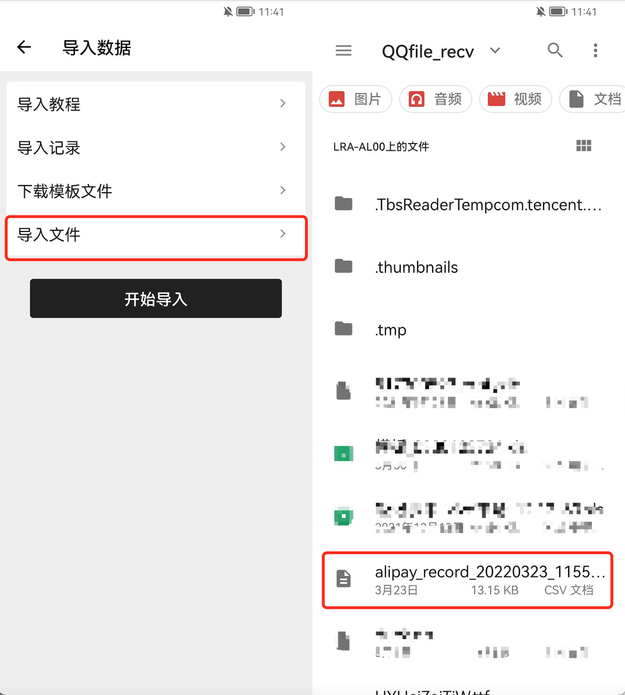
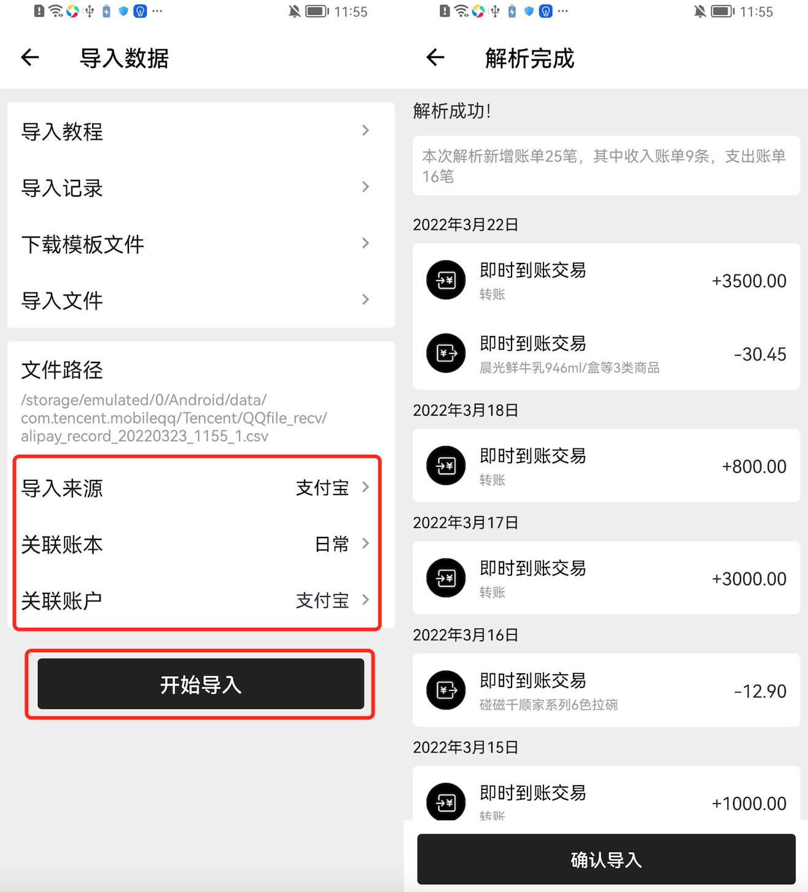

# 账单导入

### **极简记账目前支持哪些第三方平台的账单？**

1. 微信账单([导出教程](wei-xin-zhang-dan-dao-chu-jiao-cheng.md))
2. 支付宝账单([导出教程](zhi-fu-bao-zhang-dan-dao-chu-jiao-cheng.md))
3. 极简记账
4. 鲨鱼记账
5. 随手记
6. 一木记账
7. 喵喵记账
8. 钱迹（目前仅支持其csv格式）
9. 微记账
10. 后续我们会逐步支持更多的第三方平台

### 如何导入账单

1.进入<mark style="background-color:blue;">极简记账</mark> -> <mark style="background-color:blue;">我的</mark> -> <mark style="background-color:blue;">导入数据</mark> -> <mark style="background-color:blue;">导入文件</mark>

2.选择需要导入的账单文件，通常为CSV格式或XLS格式，如无账单文件，请查看各个平台的导出教程；您也可以直接到系**统文件管理器中，点击您要导入的文件，使用极简记账打开或者分享至极简记账的方式导入**，推荐该方式。

3.选择您所需的账单您可以请选择<mark style="background-color:blue;">导入来源</mark>及<mark style="background-color:blue;">关联账本</mark>，如果您已在设置中开启了资产选项，那么您还可以选择<mark style="background-color:blue;">关联的账户</mark>，选择完毕后点击开始导入，如果导入过程中无错误，将会跳转到解析完成页面

4.解析完成的账单中，若存在当前您的极简记账收支分类之外的类目，系统将会自动为您生成新的分类，以确保正常导入，当然，你可以对每笔账单左划进行删除及修改分类。如对备注中为晨光鲜牛奶的分类进行分类，对该账单进行左划，直到出现菜单，点击修改分类，修改成“餐饮”分类。

5.确认账单无误后，点击<mark style="background-color:blue;">确认导入</mark>，系统将会根据原始账单生成的时间依次插入到极简记账的账单中，您可以返回到极简记账中查看。所有的账单将会在<mark style="background-color:blue;">我的</mark> -> <mark style="background-color:blue;">导入数据</mark> -> <mark style="background-color:blue;">导入记录</mark>中生成一条记录，如果数据有误，您可以进行批量删除

### 账单导入的其他问题

#### 1.为什么导入的数据会不全？

极简记账目前只支持收入及支出账单的类型，暂时还不支持转账类型的类型哦，后续我们会努力完善该功能哒

#### 2.为什么选择导入来源后会提示解析失败？

首先确认您导出的账单与导入来源一致，如果一致的情况下有因为各个平台在版本更新的时候有时候会对账单导出格式进行变更，解析失败说明该平台的账单文件格式进行了变更，麻烦您反馈给我们，我们将第一时间进行适配

#### 3.如果我的账单不是上面的平台该怎么办？

您可以选择

* 整理其他平台数据至模板，使用模板导入([导入教程](mu-ban-zhang-dan-dao-ru-jiao-cheng.md))
* 联系我们，进行适配

&#x20;
