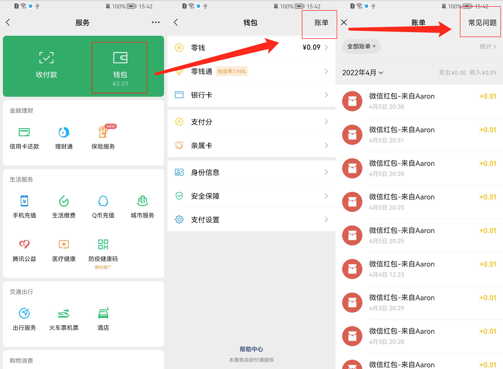

# 微信账单导出教程

### 微信账单导出步骤

1. 启动微信
2. 进入<mark style="background-color:green;">我</mark> -> <mark style="background-color:green;">服务</mark> -> <mark style="background-color:green;">钱包</mark> -> <mark style="background-color:green;">账单</mark> -> <mark style="background-color:green;">常见问题</mark>；

3.等待列表加载完毕，点击<mark style="background-color:green;">下载账单</mark>，选择<mark style="background-color:green;">用于个人对账</mark>，选择您所需要<mark style="background-color:green;">账单时间</mark>，然后点击<mark style="background-color:green;">下一步</mark>，微信最多可支持导出3个月账单。

4.请输入您的邮箱，您的邮箱将会收到微信账单的文件，确定您的邮箱账号无误，输入您的支付密码，验证完成后提示申请已提交，后续请至收件邮箱处查看账单文件，微信导出的账单是带有密码的压缩包，返回至微信首页，微信支付将会发送带有密码的消息给您。您使用该密码即可解压文件。

5.进入到收件邮箱里下载文件，下载完成过后，使用微信支付发送的解压码进行解压文件，解压完成后可以通过微信/QQ等方式将解压的微信账单文件保存至手机处。

6.将文件保存至手机后，返回至极简记账，使用账单导入功能进行导入([导入教程](./))
