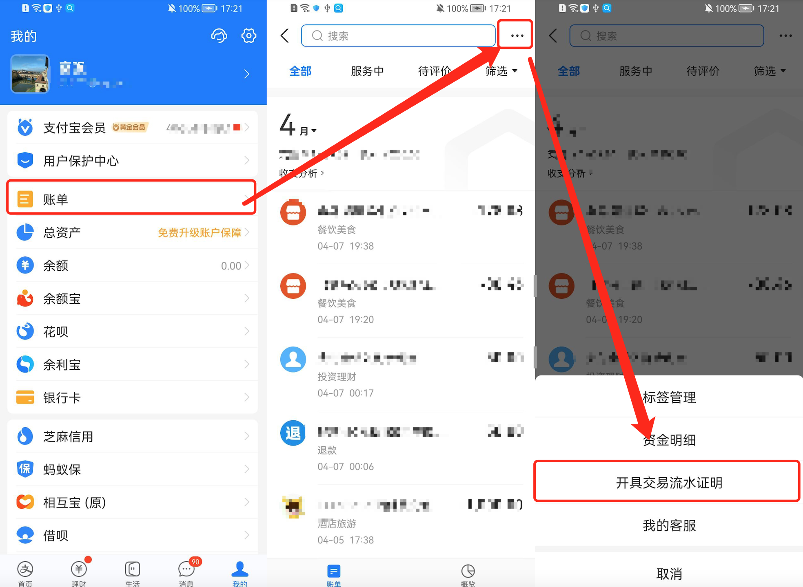
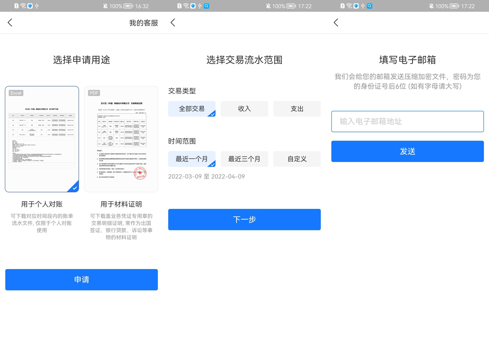
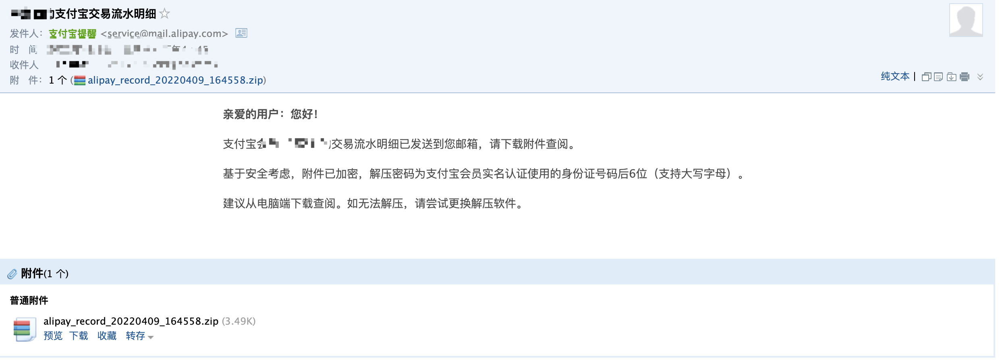
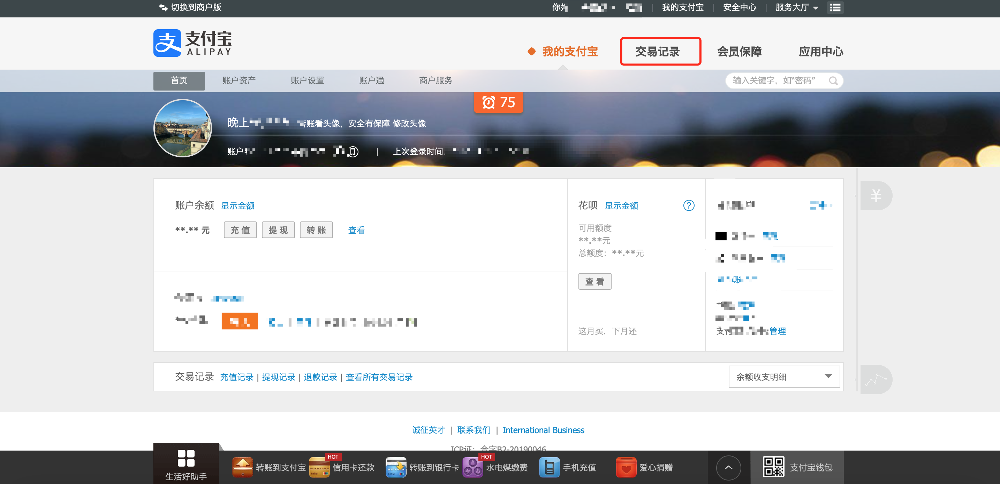
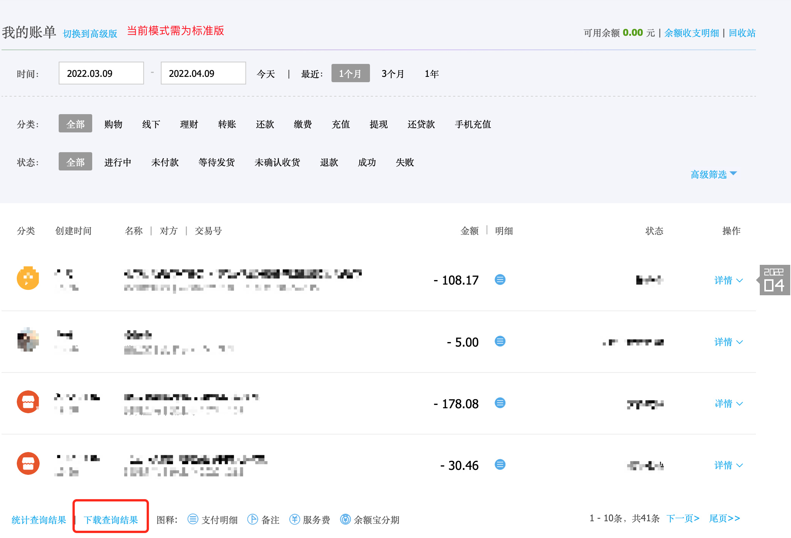

# 支付宝账单导出教程

### 通过手机导出

1.进入 <mark style="background-color:blue;">我的</mark> -> <mark style="background-color:blue;">账单</mark> -> 点击右上角更多按钮<mark style="background-color:blue;">...</mark> -> <mark style="background-color:blue;">开具交易流水证明</mark>；

2.选择 <mark style="background-color:blue;">用于个人对账</mark> -> 申请，输入支付密码；

3.选择 <mark style="background-color:blue;">交易类型</mark>及<mark style="background-color:blue;">交易流水范围</mark>，点击下一步；

4.输入您接收账单的电子邮箱，确定无误后点击发送；

5.发送完成后您可以到收件邮箱查看邮件，下载支付宝账单文件，解压密码为您身份证的后6位。解压完成后可以通过微信/QQ等方式将解压的支付宝账单文件保存至手机处。

6.将文件保存至手机后，返回至极简记账，使用账单导入功能进行导入([导入教程](./))

### 通过支付宝网页导出

1.请在电脑上登录支付宝官网：[https://www.alipay.com](https://www.alipay.com),选择<mark style="background-color:blue;">**我是个人用户**</mark>进行登录

2.点击 <mark style="background-color:blue;">**交易记录**</mark>

3.筛选你所需要的支付宝账单时间及分类，拖动网页到最下方，点击 <mark style="background-color:blue;">**下载查询结果**</mark> (需在标准版模式下)

4.文件下载至电脑后，将可以通过微信/QQ等方式将解压的支付宝账单文件保存至手机处。

5.将文件保存至手机后，返回至极简记账，使用账单导入功能进行导入([导入教程](./))

